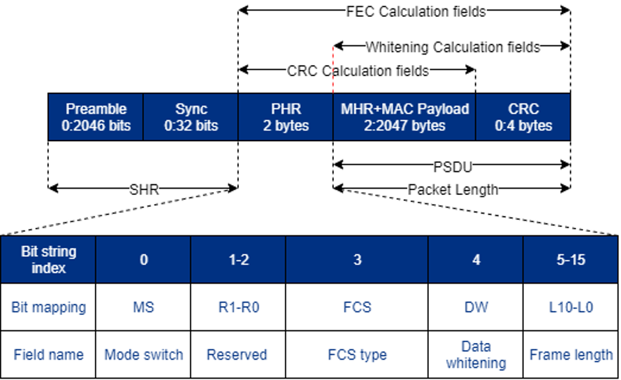
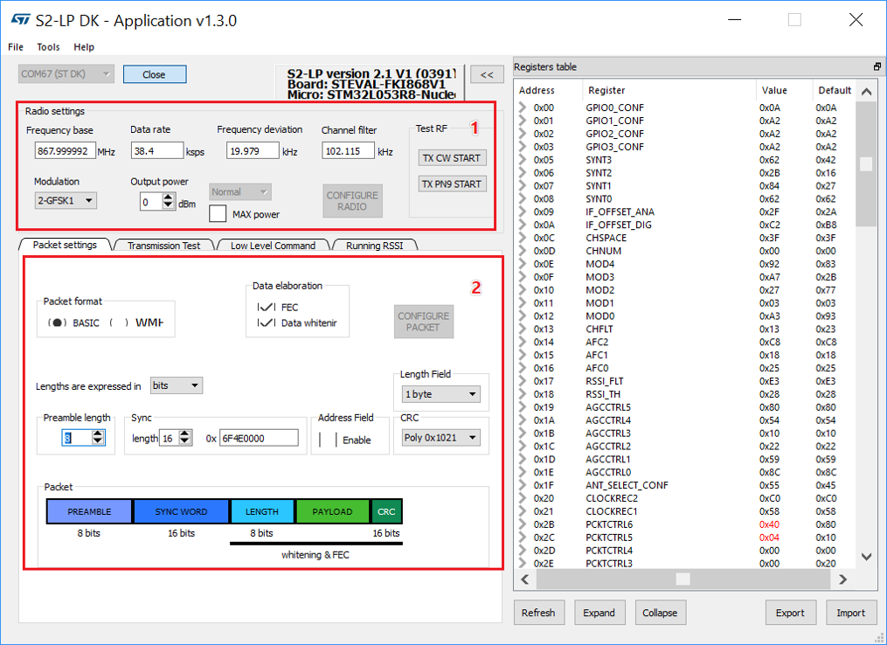
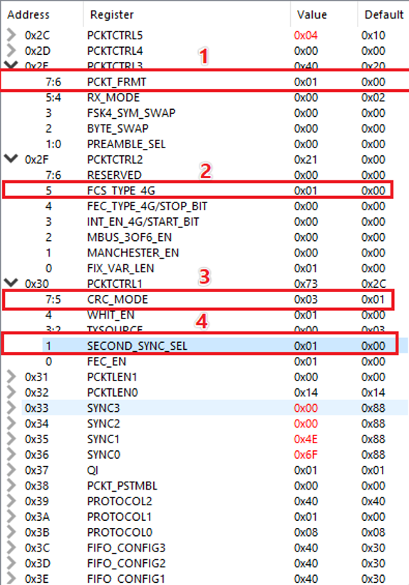
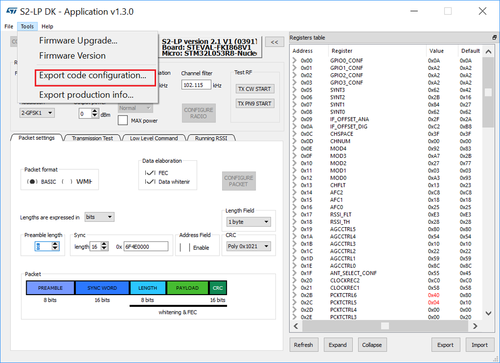
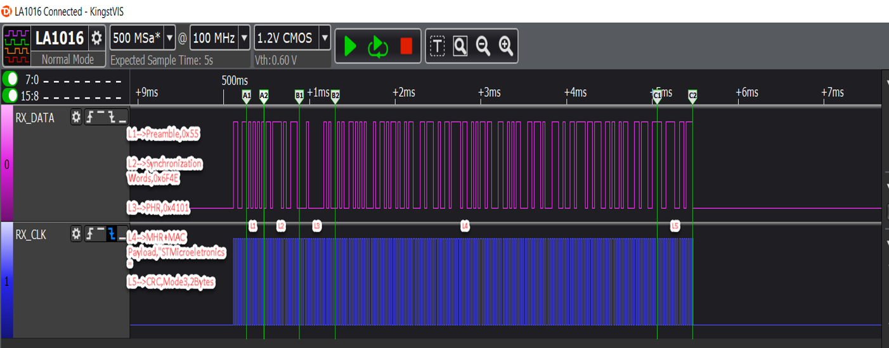

<!--
 * @Author: your name
 * @Date: 2020-02-13 17:14:49
 * @LastEditTime : 2020-02-13 18:18:13
 * @LastEditors  : Please set LastEditors
 * @Description: In User Settings EditD
 * @FilePath: \Sub1G\README.md
 -->
# Brief
This txt file shows you how to use those source files

# 802.15.4g packet format
Based on the S2LP product specification, it supports the 802.15.4g packet format and its details as shown as the following snapshot:



# How to use?
To configure the packet format of S2LP to 802.15.4g, please follow the following instructions below

## Step 1
- Set the RF parameters you expected
- Configure Data elaboration, Preamble, SYNC Word and CRC. Note: The snapshot shows the settings of SUN PHY **(Format of the MR-FSK PPDU (without mode switch))**


## Step 2


as seen from the snapshot above, the detailed explanation as follows:
1. ¡®1¡¯ means 802.15.4g Packet Format
2. FCS type in header field of 802.15.4g packet. FCS is set to:
    - 0b if CRC mode 5 is selected(4 bytes)
    - 1b if CRC mode 3 is selected(2 bytes)
3. CRC poly selection
    - 0: no CRC field
    - 1: mode 1: 8 bits: the poly is (0x07)
    - 2: mode 2: 16 bits: the poly is (0x8005)
    - 3: mode 3: 16 bits: the poly is (0x1021)
    - 4: mode 4: 24 bits: the poly is (0x864CFB)
    - 5: mode 5: 32 bits the poly is (0x04C011BB7 ) 802.15.4g compatible
4. SECOND_SYNC_SEL(optional)
    - In TX mode:
        - 0 select the primary SYNC word	
        - 1 select the secondary SYNC word
    - In RX mode, if 1 enable the dual SYNC word detection mode
## Step 3
Export code configuration after finishing the RF parameters settings


## Step 4
Source code modification based on SDK_BasicGeneric_A/B example project (according to the previous step: export code configuration), the details as shown as below: 
1. [Transmitter](Source%20files/SDK_BasicGeneric_A.c)
2. [Receiver](Source%20files/SDK_BasicGeneric_B.c)

After rewriting the SDK_BasicGeneric_A/B.c files, you can run this example project with 802.15.4g packet format directly. there are three different styles:

- style1
    ```c
    /* 
    1. FEC Enable
    2. Data Whitening Enable
    3. preamble-->0x55
    4. Synchronization words-->0x6F4E0000
    5. 802.15.4g format
    6. Secondary Synchronization words-->0xAABB0000
    7. CRC Mode-->3
    8. FCS type-->1
    9. RF settings 
    -- Frequency base      :868Mhz
    -- Data Rate           :38.4ksps
    -- Frequency deviation :20Khz
    -- Channel filter      :100Khz

    Note: the total packet length is equal to MHR+MAC Payload + CRC
    */
    ```
- style2
    ```c
    /* 
    1. FEC Disable
    2. Data Whitening Enable
    3. preamble-->0x55
    4. Synchronization words-->0x6F4E0000
    5. 802.15.4g format
    6. Secondary Synchronization words-->disable
    7. CRC Mode-->3
    8. FCS type-->1
    9. RF settings 
    -- Frequency base      :868Mhz
    -- Data Rate           :38.4ksps
    -- Frequency deviation :20Khz
    -- Channel filter      :100Khz

    Note: the total packet length is equal to MHR+MAC Payload + CRC
    */
    ```
- style3
    ```c
    /* 
    1. FEC Disable
    2. Data Whitening Disable
    3. preamble-->0x55
    4. Synchronization words-->0x6F4E0000
    5. 802.15.4g format
    6. Secondary Synchronization words-->Enable
    7. CRC Mode-->3
    8. FCS type-->1
    9. RF settings 
    -- Frequency base      :868Mhz
    -- Data Rate           :38.4ksps
    -- Frequency deviation :20Khz
    -- Channel filter      :100Khz

    Note: the total packet length is equal to MHR+MAC Payload + CRC
    */
    ```
# Test Result
we have tested by following the steps above with FKI868V2 DK and it can work well
## Data Capture

## Message Output


# Issue
Any issues you encountered, please summit your requests via **Issues** Option